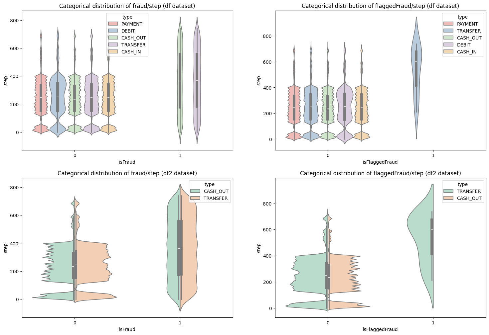

# Fraud Detection Analysis

## Overview

This project involves the analysis of a large-scale transaction dataset to detect fraudulent activities using machine learning techniques. The dataset contains over 6 million transaction records, with various features capturing the details of each transaction.

## Dataset Description

The dataset used in this project can be accessed [here](https://drive.google.com/file/d/1TSnh9aRXxMaCcGiyoNAr1tbf5_PNghAm/view?usp=drive_link) (Dataset).

## Dataset Description

The dataset consists of the following columns:

- **step**: A unit of time where each step is equivalent to an hour.
- **type**: The type of transaction (e.g., 'CASH_OUT', 'PAYMENT').
- **amount**: The transaction amount.
- **nameOrig**: The customer who initiated the transaction.
- **oldbalanceOrg**: The initial balance of the customer before the transaction.
- **newbalanceOrig**: The new balance of the customer after the transaction.
- **nameDest**: The recipient of the transaction.
- **oldbalanceDest**: The initial balance of the recipient before the transaction.
- **newbalanceDest**: The new balance of the recipient after the transaction.
- **isFraud**: A flag indicating whether the transaction is fraudulent (1 for fraud, 0 for non-fraud).
- **isFlaggedFraud**: A flag indicating whether the transaction was flagged as potentially fraudulent by the system.

### Dataset Statistics

- **Total Transactions**: 6,362,620
- **Fraudulent Transactions**: *Number of fraudulent transactions* (from your EDA)
- **Non-Fraudulent Transactions**: *Number of non-fraudulent transactions* (from your EDA)

### Exploratory Data Analysis (EDA)

Extensive exploratory data analysis was performed to understand the characteristics of the dataset and the distribution of fraudulent transactions. Key findings include:

1. **Class Imbalance**:
   - The dataset exhibits a significant class imbalance, with a small fraction of transactions labeled as fraudulent (`isFraud = 1`). This imbalance necessitated the use of specialized techniques during model training to ensure accurate detection of fraudulent activities.

2. **Transaction Types**:
   - The dataset includes various types of transactions, such as 'CASH_OUT', 'PAYMENT', 'TRANSFER', etc. Some transaction types, particularly 'CASH_OUT' and 'TRANSFER', were found to have a higher incidence of fraud.

3. **Feature Analysis**:
   - **diffOrg**: A new feature created to capture the difference in the origin account's balance before and after the transaction. Anomalies in this feature were found to correlate with fraudulent activities.
   - **suspectRatio**: Another derived feature that combines `oldbalanceOrg`, `amount`, and `newbalanceDest`. This ratio was useful in identifying suspicious transactions where the transferred amount significantly impacted the recipient's balance.

4. **Correlation Analysis**:
   - Correlation analysis between features revealed that certain features, such as `amount`, `oldbalanceOrg`, and `newbalanceOrig`, have a significant relationship with the `isFraud` label, providing insights into potential indicators of fraud.

### Machine Learning Model: XGBoost Classifier

A machine learning model was developed using the XGBoost classifier, which is known for its high performance in classification tasks, especially with imbalanced datasets.

- **Model Training**:
  - The model was trained on the processed dataset, with special attention to handling the class imbalance. Techniques such as oversampling of the minority class and weighted loss functions were employed.

- **Model Evaluation**:
  - The model's performance was evaluated using metrics such as accuracy, precision, recall, and F1-score, with a focus on maximizing recall to ensure that fraudulent transactions are detected effectively.

### Conclusion

The combination of extensive EDA and the implementation of a robust XGBoost classifier resulted in a model that is capable of detecting fraudulent transactions with high accuracy. The insights gained from feature engineering, particularly the creation of `diffOrg` and `suspectRatio`, were instrumental in enhancing the model's ability to identify fraud.

---

This `README.md` file provides an overview of the data analysis and model development process. For more detailed insights and code implementation, please refer to the accompanying Jupyter notebooks and source files.
